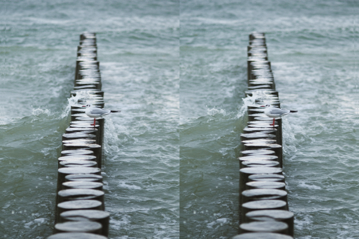

# Example

## Command Line

Run `./AutoStereo -i Source.png -d Depth.png -o AutoStereo.png --FocusPoint 160 --StereoSeparation 8`

## Source Images

Source:

Depth Map:

## Output

## Output (with `--FlipEyes`)

